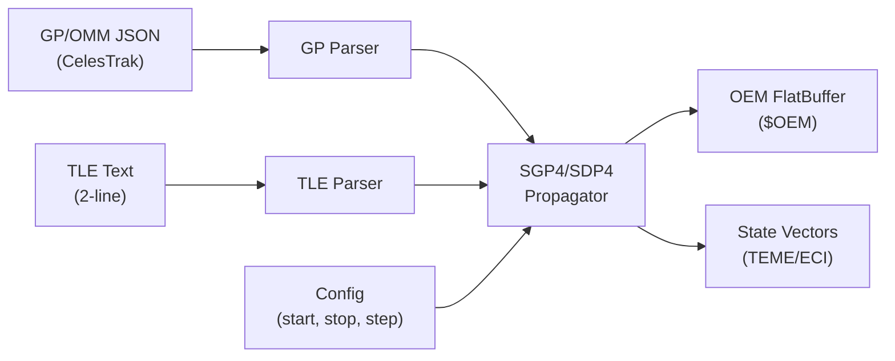

# 🛰️ SGP4 Propagator Plugin

[](https://github.com/the-lobsternaut/sgp4-propagator-sdn-plugin/actions)
[](LICENSE)
[](https://en.cppreference.com/w/cpp/17)
[](wasm/)
[](https://github.com/the-lobsternaut)

**SGP4/SDP4 orbital propagation — takes GP/OMM elements, outputs OEM FlatBuffer ephemeris. Supports integer NORAD IDs (no TLE text 5-digit limit) via direct GP→SGP4 path.**

---

## Overview

The SGP4 Propagator is the workhorse orbit predictor for the Space Data Network. It implements the USAF Simplified General Perturbations model (SGP4 for LEO, SDP4 for deep space) for propagating Two-Line Element / General Perturbations data.

### Key Features

- **GP/OMM JSON input** — direct ingestion from CelesTrak GP/OMM format (no TLE text parsing needed)
- **Integer NORAD IDs** — supports catalog numbers > 99999 (beyond legacy 5-digit TLE limit)
- **OEM FlatBuffer output** — CCSDS-compliant orbit ephemeris messages
- **Batch propagation** — process entire catalogs (47,000+ objects)
- **WASM** — full propagator in the browser with 16–128 MB memory

### SGP4 vs SDP4

| Model | Regime | Period | Effects |
|-------|--------|--------|---------|
| SGP4 | Near-Earth | < 225 min | J2/J3/J4 secular + short-periodic |
| SDP4 | Deep-space | ≥ 225 min | + Sun/Moon third-body resonances |

---

## Architecture



---

## Data Sources & APIs

| Source | URL | Purpose |
|--------|-----|---------|
| **CelesTrak** | [celestrak.org/NORAD/elements/gp.php](https://celestrak.org/NORAD/elements/gp.php) | GP/OMM JSON elements |
| **Space-Track** | [space-track.org](https://www.space-track.org/) | Official TLE/GP data |

---

## Research & References

- Hoots, F. R. & Roehrich, R. L. (1980). "Models for Propagation of NORAD Element Sets." *Spacetrack Report No. 3*. The original SGP4 reference.
- Vallado, D. A. et al. (2006). ["Revisiting Spacetrack Report #3"](https://doi.org/10.2514/6.2006-6753). AAS/AIAA. Modern SGP4 implementation reference.
- Vallado, D. A. (2013). *Fundamentals of Astrodynamics and Applications*, 4th ed. Ch. 9 — SGP4 theory and implementation.
- **CCSDS 502.0-B-3** — Orbit Data Messages (OEM format).

---

## Build Instructions

```bash
git clone --recursive https://github.com/the-lobsternaut/sgp4-propagator-sdn-plugin.git
cd sgp4-propagator-sdn-plugin

mkdir -p build && cd build
cmake ../src/cpp -DCMAKE_CXX_STANDARD=17
make -j$(nproc) && ctest --output-on-failure

# WASM build
./build.sh
```

---

## Usage Examples

### Propagate from GP/OMM JSON

```cpp
#include "sgp4_propagator/propagator.h"

auto gp = sgp4::parseGPJSON(gp_json_string);

sgp4::PropConfig config;
config.startMinutes = 0;
config.stopMinutes = 1440 * 7;  // 7 days
config.stepMinutes = 1;

auto ephemeris = sgp4::propagate(gp, config);
// ephemeris → $OEM FlatBuffer
```

### WASM

```javascript
const sgp4 = await SGP4_WASM.create();
const oem = sgp4.propagateGP(gpJson, startJD, 7.0, 60.0);
```

---

## Dependencies

| Dependency | Version | Purpose |
|-----------|---------|---------|
| C++17 | GCC 7+ / Clang 5+ | Core language |
| [dnwrnr/sgp4](https://github.com/dnwrnr/sgp4) | HEAD | SGP4/SDP4 implementation |
| FlatBuffers | Generated | OEM schema |
| Emscripten | Latest | WASM build |

---

## Plugin Manifest

```json
{
  "schemaVersion": 1,
  "pluginId": "sgp4-propagator",
  "pluginType": "propagator",
  "name": "SGP4 Propagator Plugin",
  "version": "0.1.0",
  "description": "SGP4/SDP4 propagator — GP/OMM to OEM FlatBuffer ephemeris.",
  "license": "Apache-2.0",
  "inputs": ["OMM", "TLE"],
  "outputs": ["$OEM"]
}
```

---

## License

Apache-2.0 — see [LICENSE](LICENSE) for details.

*Part of the [Space Data Network](https://github.com/the-lobsternaut) plugin ecosystem.*
